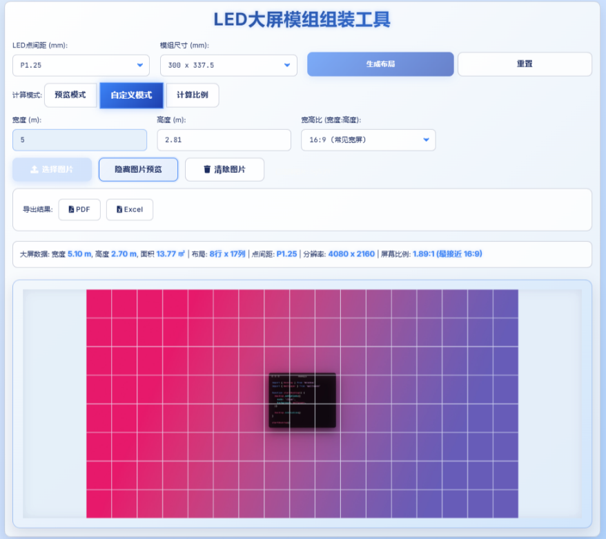

# LED 大屏模组组装工具

> 🖥️ 专为音视频工程师、显示屏厂商、项目设计人员打造的 LED 大屏模组智能布局与尺寸计算工具。  
> 快速配置布局、预览效果、计算分辨率，并支持一键导出 PDF/Excel 报告。

---

## 📌 项目简介

该工具旨在帮助用户根据 LED 点间距与模组尺寸，快速构建 LED 大屏的布局草图，并提供精确的分辨率、尺寸和比例计算。  
支持常规预设和自定义输入，可视化预览，同时支持导出为 PDF 和 Excel 文件。

---

## ✨ 功能特点

- 💡 多种计算模式：行列输入、自定义尺寸、屏幕比例自动计算
- 📐 实时尺寸、分辨率、面积自动计算
- 🖼️ 支持上传图片作为背景预览
- 📤 支持导出为高质量 PDF 报告或 Excel 表格
- 🎨 响应式科技感界面，移动端/桌面端完美适配

---

## 🚀 使用方法

1. 打开 `index.html`
2. 选择 LED 点间距（如 P1.25、P2.5）
3. 选择模组尺寸（如 320x160 mm）
4. 选择计算模式（预览模式 / 自定义尺寸 / 比例模式）
5. 输入参数并点击 `生成布局`
6. （可选）上传背景图片，辅助设计预览
7. 点击导出按钮生成 PDF 或 Excel 文件

---

## 📄 示例截图



---

## 🛠️ 技术栈

- HTML5 + CSS3 + JavaScript
- [Bootstrap 5](https://getbootstrap.com/)
- [XLSX.js](https://github.com/SheetJS/sheetjs) — Excel 导出支持
- [jsPDF](https://github.com/parallax/jsPDF) — PDF 导出支持
- FontAwesome 图标库
- Google Fonts 字体
- Canvas 渲染技术

---

## 📦 本地部署

无需复杂环境，直接打开即可使用：

```bash
git clone https://github.com/your-username/your-repo-name.git
cd your-repo-name
open index.html
